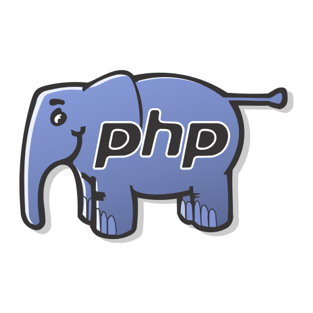

<h3> _ Hi, i'm FastChen(快辰)! 👋</h3>

## 已解锁语言 & Language achievement

### "人类语言(Human language)"

 

### "机器语言(Machine language)"

<code></code>
<code></code>
<code></code>
<code></code>
<code></code>

**前端(Frontend)**

<code></code>
<code></code>
<code></code>

**后端(Backend)**

<code></code>
<code></code>

### 找到我(Find me)

### Organizations

<a href="https://github.com/NullCraftOrg">@NullCraftOrg</a>

